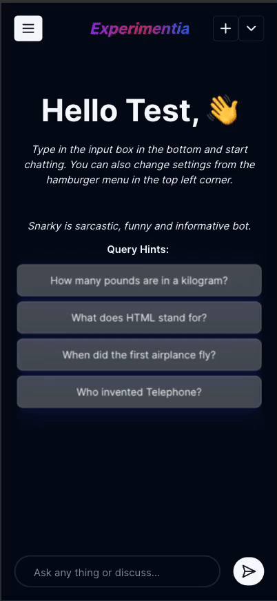

## PolyChat

Welcome to PolyChat, where I'm just exploring LLMs! Below, you'll find information on technologies used, supported browsers, installation instructions, and how to set up the environment.

## Features

- Voice input capability
- Save chats (including images converted to base64) locally in IndexDB
- Download generated images

## Technologies

- Turborepo
- TypeScript
- React Router 7
- shadcn
- Jotai
- Clerk
- Node.js (TypeScript)
- AWS Lambda
- Vercel AI SDK

## Support

Voice input is currently compatible only with Chrome and WebKit-based browsers. Please ensure you are using one of these browsers for the optimal experience.

## Installation

To get started with PolyChat, follow these simple steps:

1. **Clone the Repository:**

   ```bash
   git clone https://github.com/abdulsamad/polychat.git
   ```

2. **Install Dependencies:**

   ```bash
   cd polychat
   pnpm install
   ```

3. **Environment Variables:**
   Create a `.env` file in both the `apps/client` and `apps/server` directories. Copy the required variables and template from `apps/client/.env.example` and `apps/serverless/.env.example`.

## Development

To start the local server and begin development:

```bash
pnpm dev
```

<!-- 
## Demo
<p align="center">
<br/>

<br/>
</p>
-->
